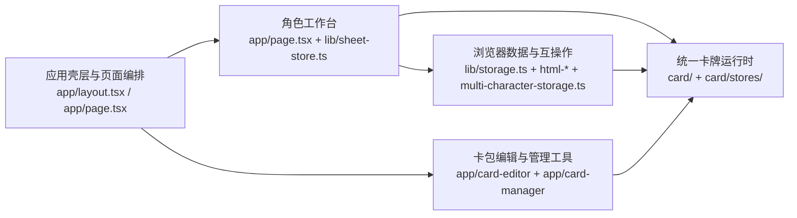
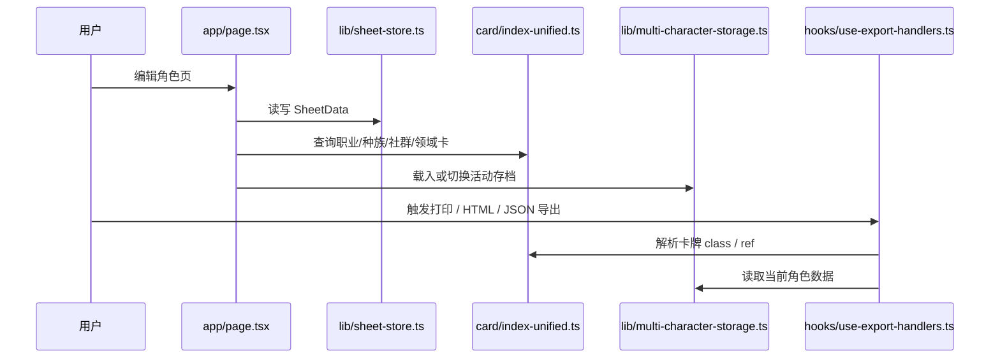
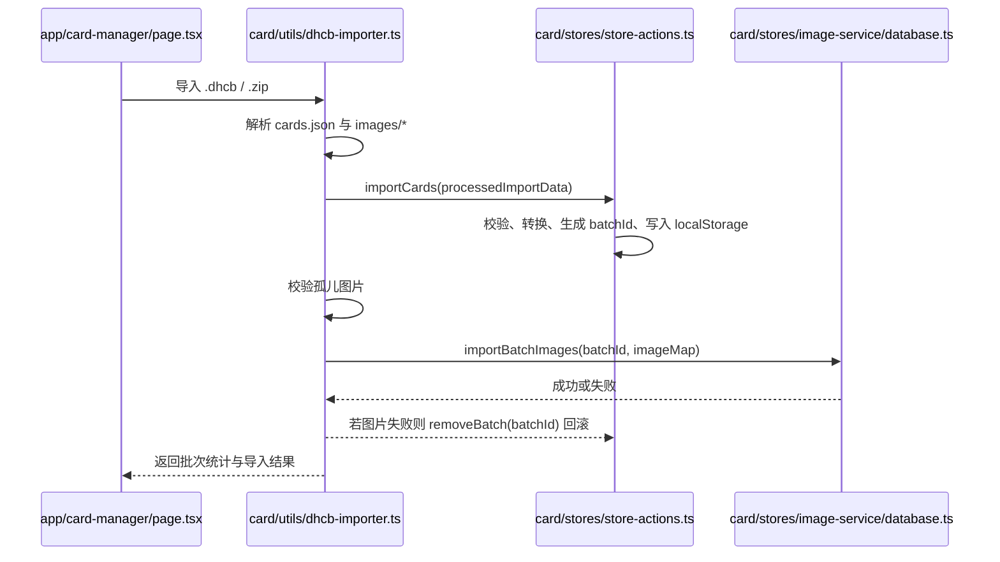

> generated_by: nexus-mapper v2
> verified_at: 2026-04-22
> provenance: The repository-level import graph could not be recovered from current AST output, so the diagrams below are inferred from entry files, public APIs and manual inspection of state/store wiring.

# 系统依赖

## 总览

下面的依赖图不是“源码 import 的逐条还原”，而是当前仓库里真实工作流的系统级依赖关系。它反映谁负责编排、谁提供领域能力、谁承担持久化和互操作。

## 主站角色流

## 自定义卡包导入流

## 关键依赖解释

- `应用壳层` 只负责把主题、初始化器、通知、页面框架和主流程拼起来，不负责业务规则。
- `角色工作台` 是主业务入口，但所有卡牌语义都来自 `统一卡牌运行时`，所有角色持久化与导出又依赖 `浏览器数据与互操作`。
- `卡包编辑与管理工具` 共享统一卡牌系统，而不是维护另一套卡牌模型；这保证了编辑器、管理页和主站看到的是同一批标准卡牌对象。
- `浏览器数据与互操作` 一方面服务主站，另一方面也借助卡牌系统计算导出文件名和解析卡牌引用，因此它不是完全独立的底层库。

## 依赖图的证据缺口

- 由于当前 AST 输出没有恢复出可用的内部 import 解析结果，本文件中的箭头方向来自入口文件与 API 调用关系，不代表逐条 import 明细。
- 如果后续任务需要精确到“谁 import 了谁”，请重新运行 `query_graph.py` 并结合手工阅读确认。
