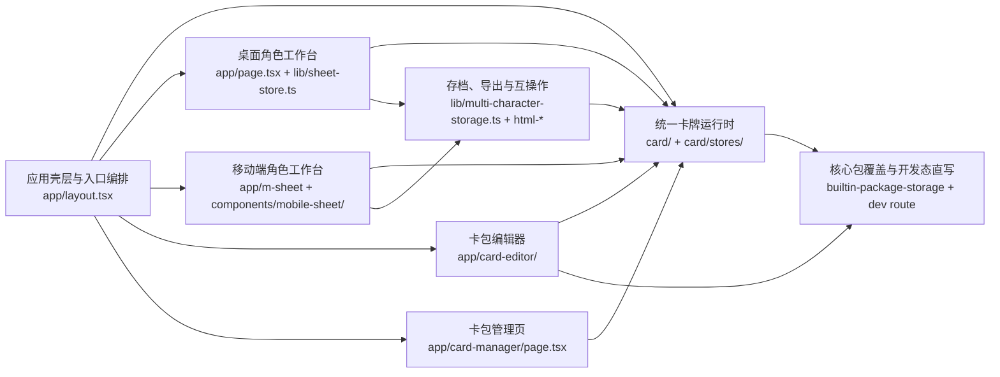
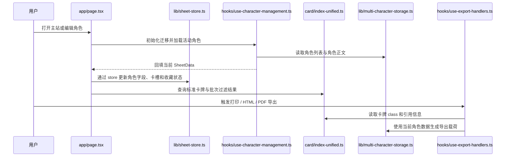
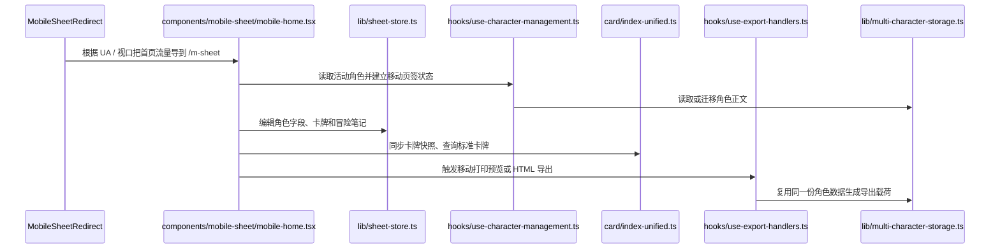
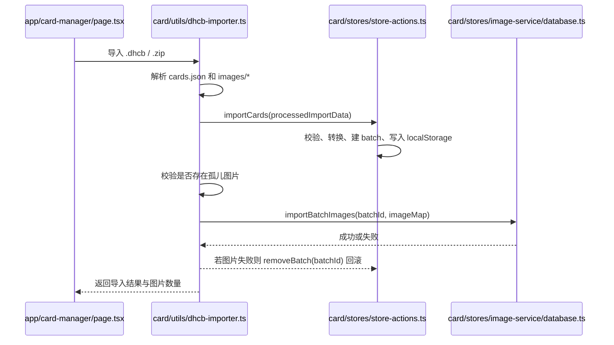
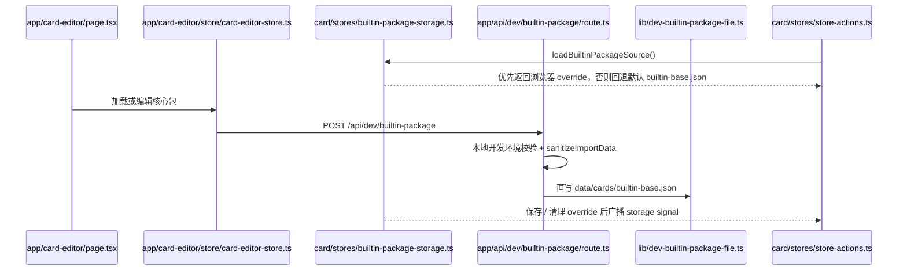

> generated_by: nexus-mapper v2
> verified_at: 2026-05-02
> provenance: The diagrams below are inferred from entry files, store APIs and manual inspection. Current AST output preserved module structure, but `query_graph.py` still did not recover actionable internal alias-import edges for this repository, so dependency arrows below are system-level conclusions rather than import-accurate graphs.

# 系统依赖

## 总览

下面的图不是逐条 `import` 的机器还原，而是当前仓库真实业务链路的系统级依赖关系。重点在于“谁编排谁”“谁复用同一份角色数据”“谁提供共享卡牌语义”和“核心包覆盖链路插在什么位置”。

## 桌面角色流

## 移动端角色流

## 卡包导入流

## 核心包覆盖流

## 关键依赖说明

- `应用壳层` 不做业务决策，但它直接决定统一卡牌系统何时初始化、移动端何时重定向，以及 4 条主流程何时可见。
- `桌面角色工作台` 与 `移动端角色工作台` 共享同一套 `SheetData`、角色管理、导出和卡牌同步底盘，因此底层字段或导出语义变化不能只回归一个入口。
- `统一卡牌运行时` 仍是最重要的共享业务底盘，主站、移动端、编辑器和管理页都依赖它的标准卡牌与批次语义。
- `核心包覆盖与开发态直写` 是运行时和编辑器之间新增的一层互操作通道：运行时从这里读核心包来源，编辑器也通过它触发跨标签刷新和本地开发态持久化。
- `存档、导出与互操作` 不是纯底层工具库，因为导出标题、卡牌 class 和部分 HTML 互操作仍要回查统一卡牌运行时。

## 依赖图的证据缺口

- 由于当前 AST 对路径别名导入的恢复不完整，本文件里的箭头方向来自入口文件和公开 API 的真实调用关系，而不是逐条 import 清单。
- `query_graph.py --hub-analysis` 当前未恢复出可用的内部扇入/扇出结果，所以这里的系统边界主要依赖人工验证过的入口文件与 store API。
- 如果后续任务需要精确到“谁 import 了谁”，请先重跑 `query_graph.py`，再结合人工阅读确认结果是否可信。
